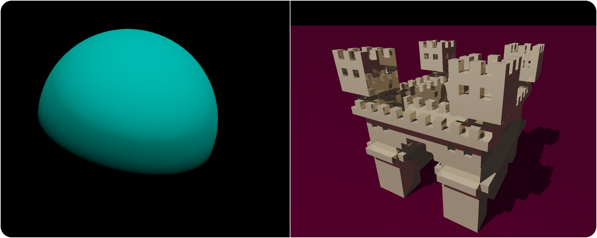

# CPU Raytracer

A raytracer implemented in C++. This project is part of a university assignment for the module "Programmier Paradigmen" at TUHH.

## Features

- Phong lighting model
- Raytraced reflections and shadows
- Voxel models
- Multithreading
- GUI and CLI
- Scene serialization
- Live editing
- HDR textures
- Almost real-time (Not when compiling with debug configuration)

## See also

- [How to build](doc/build.md)
- [Examples](doc/examples.md)
- [Project report (Usage)](doc/final_report.md)
- [Class diagram](doc/class_diagram.md)
- [Preliminary conception design (System design)](doc/preliminary_conception_design.md)

## Dependencies

- [CMake](https://cmake.org/)
- GCC or MSVC
- [Doxygen](https://www.doxygen.nl/index.html) (Optional)
- OpenGL 3.3 (Only when running with GUI)
- C/C++ libs (self contained)
  - [GLFW](https://www.glfw.org/)
  - [Glad](https://glad.dav1d.de/)
  - [Dear ImGui](https://github.com/ocornut/imgui)
  - [STB Image](https://github.com/nothings/stb)
  - [GLM](https://glm.g-truc.net/0.9.9/index.html)
  - [yaml-cpp](https://github.com/jbeder/yaml-cpp)
  - [NativeFileDialog](https://github.com/mlabbe/nativefiledialog)
  - [TCLAP](https://tclap.sourceforge.net/)
