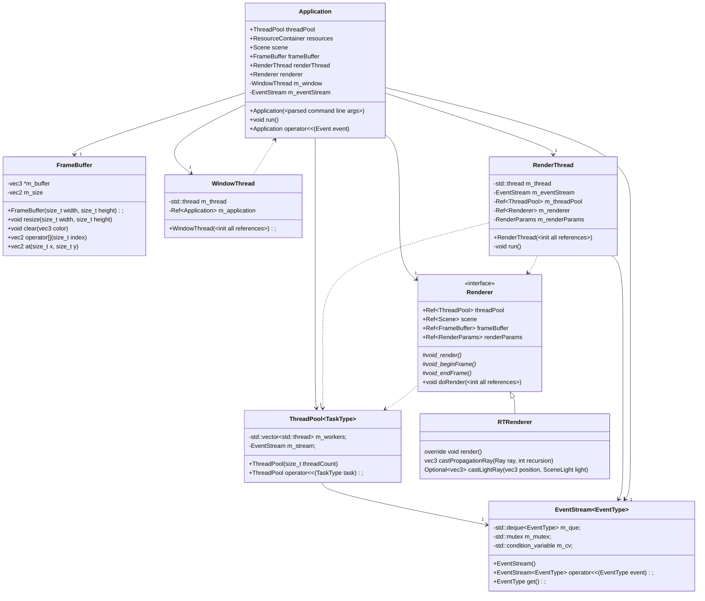
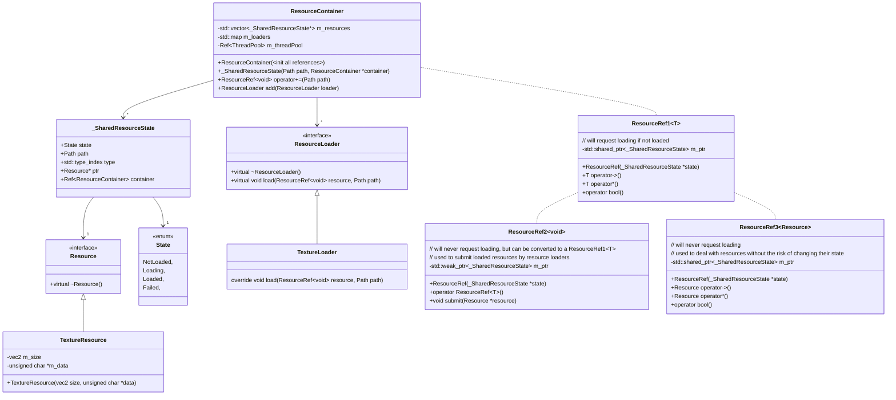
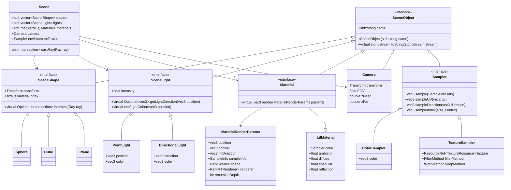

# Class Diagramm

- `Ref<T>` is a synonym for the concept of a reference to an object, that is not owned by the current party

## Application

```mermaid
classDiagram
    class EventStream~EventType~
    class ThreadPool~TaskType~
    
    Application --> "1" FrameBuffer

    Application --> "1" WindowThread
    Application --> "1" RenderThread

    WindowThread ..> Application

    Application --> "1" ThreadPool

    RenderThread ..> ThreadPool

    ThreadPool --> "1" EventStream
    
    RenderThread --> "1" EventStream
    Application --> "1" EventStream

    Renderer ..> ThreadPool
    Application --> "1" Renderer

    RenderThread ..> Renderer

    class Application {
        +ThreadPool threadPool
        +ResourceContainer resources
        +Scene scene
        +FrameBuffer frameBuffer
        +RenderThread renderThread
        +Renderer renderer
        -WindowThread m_window
        -EventStream m_eventStream

        +Application(~parsed command line args~)
        +void run()
        +Application operator<<(Event event)
    }

    class RenderThread {
        -std::thread m_thread
        -EventStream m_eventStream
        -Ref~ThreadPool~ m_threadPool
        -Ref~Renderer~ m_renderer
        -RenderParams m_renderParams

        +RenderThread(~init all references~)
        -void run()
    }

    class WindowThread {
        -std::thread m_thread
        -Ref~Application~ m_application

        +WindowThread(~init all references~);
    }

    class EventStream~EventType~ {
        -std::deque~EventType~   m_que;
        -std::mutex              m_mutex;
        -std::condition_variable m_cv;

        +EventStream()
        +EventStream~EventType~ operator<<(EventType event);
        +EventType get();
    }

    class ThreadPool~TaskType~ {
        -std::vector~std::thread~ m_workers;
        -EventStream m_stream;

        +ThreadPool(size_t threadCount)
        +ThreadPool operator<<(TaskType task);
    }

    class FrameBuffer {
        -vec3 *m_buffer
        -vec2 m_size

        +FrameBuffer(size_t width, size_t height);
        +void resize(size_t width, size_t height)
        +void clear(vec3 color)
        +vec2 operator[](size_t index)
        +vec2 at(size_t x, size_t y)
    }

    class Renderer {
        <<interface>>
        +Ref~ThreadPool~ threadPool
        +Ref~Scene~ scene
        +Ref~FrameBuffer~ frameBuffer
        +Ref~RenderParams~ renderParams

        #void_render()*
        #void_beginFrame()*
        #void_endFrame()*
        +void doRender(~init all references~)
    }

    Renderer <|-- RTRenderer
    class RTRenderer {
        override void render()
        vec3 castPropagationRay(Ray ray, int recursion)
        Optional~vec3~ castLightRay(vec3 position, SceneLight light)
    
    }

```

## Resource Container

```mermaid
classDiagram
    ResourceContainer --> "*" ResourceLoader
    ResourceContainer --> "*" _SharedResourceState
    _SharedResourceState --> "1" Resource
    _SharedResourceState --> "1" State

    class ResourceContainer {
        -std::vector~_SharedResourceState*~ m_resources
        -std::map<std::type_index, ResourceLoader*> m_loaders
        -Ref~ThreadPool~ m_threadPool

        +ResourceContainer(~init all references~)
        +_SharedResourceState(Path path, ResourceContainer *container)
        +ResourceRef~void~ operator+=(Path path)
        +ResourceLoader add(ResourceLoader loader)
    }

    class _SharedResourceState {
        +State state
        +Path path
        +std::type_index type
        +Resource* ptr
        +Ref~ResourceContainer~ container
    }

    class State {
        <<enum>>
        NotLoaded,
        Loading,
        Loaded,
        Failed,
    }

    class Resource {
        <<interface>>
        +virtual ~Resource()
    }

    Resource <|-- TextureResource
    class TextureResource {
        -vec2 m_size
        -unsigned char *m_data
        +TextureResource(vec2 size, unsigned char *data)
    }

    class ResourceLoader {
        <<interface>>
        +virtual ~ResourceLoader()
        +virtual void load(ResourceRef~void~ resource, Path path)
    }

    ResourceLoader <|-- TextureLoader
    class TextureLoader {
        override void load(ResourceRef~void~ resource, Path path)
    }

    ResourceContainer .. ResourceRef1~T~
    ResourceRef1~T~ .. ResourceRef2~void~
    ResourceRef1~T~ .. ResourceRef3~Resource~

    class ResourceRef1~T~ {
        // will request loading if not loaded
        -std::shared_ptr~_SharedResourceState~ m_ptr
        +ResourceRef(_SharedResourceState *state)
        +T operator->()
        +T operator*()
        +operator bool()
    }

    class ResourceRef2~void~ {
        // will never request loading, but can be converted to a ResourceRef1~T~
        // used to submit loaded resources by resource loaders
        -std::weak_ptr~_SharedResourceState~ m_ptr
        +ResourceRef(_SharedResourceState *state)
        +operator ResourceRef~T~()
        +void submit(Resource *resource)
    }

    class ResourceRef3~Resource~ {
        // will never request loading
        // used to deal with resources without the risk of changing their state
        -std::shared_ptr~_SharedResourceState~ m_ptr
        +ResourceRef(_SharedResourceState *state)
        +Resource operator->()
        +Resource operator*()
        +operator bool()
    }
```

## Scene

```mermaid
classDiagram
    class Scene {
        +std::vector~SceneShape~ shapes
        +std::vector~SceneLight~ lights
        +std::map~size_t, Material~ materials
        +Camera camera
        +Sampler environmentTexture
        test~Intersection~ castRay(Ray ray)
    }

    class SceneObject {
        <<interface>>
        +std::string name

        +SceneObject(std::string name)
        +virtual std::ostream toString(std::ostream stream)
    }

    SceneObject <|-- SceneShape
    class SceneShape {
        <<interface>>
        +Transform transform
        +size_t materialIndex

        +virtual Optional~Intersection~ intersect(Ray ray)
    }

    SceneShape <|-- Sphere
    SceneShape <|-- Cube
    SceneShape <|-- Plane

    SceneObject <|-- SceneLight
    class SceneLight {
        <<interface>>
        +float intensity
        +virtual Optional~vec3~ getLightDirection(vec3 position)
        +virtual vec3 getColor(dvec3 position)
    }

    SceneLight <|-- PointLight
    SceneLight <|-- DirectionalLight

    class PointLight {
        +vec3 position
        +vec3 color
    }

    class DirectionalLight {
        +vec3 direction
        +vec3 color
    }

    SceneObject <|-- Material
    class Material {
        <<interface>>
        +virtual vec3 render(MaterialRenderParams params)
    }

    Material --> MaterialRenderParams
    class MaterialRenderParams {
        +vec3               position
        +vec3               normal
        +vec3               hitDirection
        +SampleInfo         sampleInfo
        +Ref~Scene~         scene
        +Ref~RTRenderer~    renderer
        +int                recursionDepth
    }

    Material --|> LitMaterial
    class LitMaterial {
        +Sampler color
        +float ambient
        +float diffuse
        +float specular
        +float reflection
    }

    SceneObject <|-- Camera
    class Camera {
        Transform transform
        float     FOV
        double    zNear 
        double    zFar
    }

    SceneObject <|-- Sampler
    class Sampler {
        <<interface>>
        +vec3 sample(SampleInfo info)
        +vec3 sampleUV(vec2 uv)
        +vec3 sampleDirection(vec3 direction)
        +vec3 sampleIndex(size_t index)
    }

    Sampler <|-- ColorSampler
    Sampler <|-- TextureSampler
    class ColorSampler {
        +vec3 color
    }
    class TextureSampler {
        +ResourceRef~TextureResource~ texture
        +FilterMethod filterMethod
        +WrapMethod wrapMethod
    }

    Scene --> "*" SceneShape
    Scene --> "*" SceneLight
    Scene --> "*" Material
    Scene --> "*" Camera
```