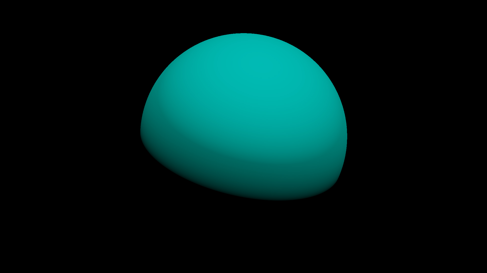
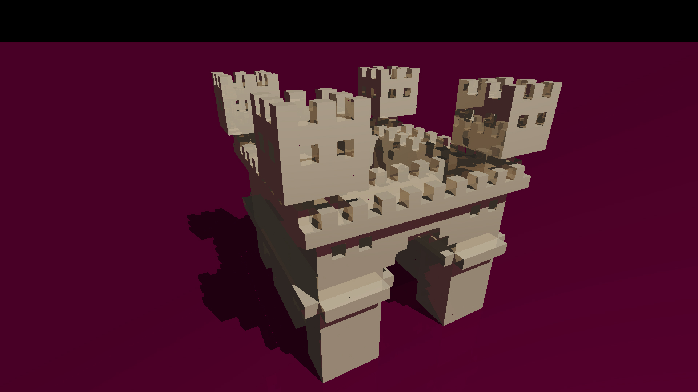
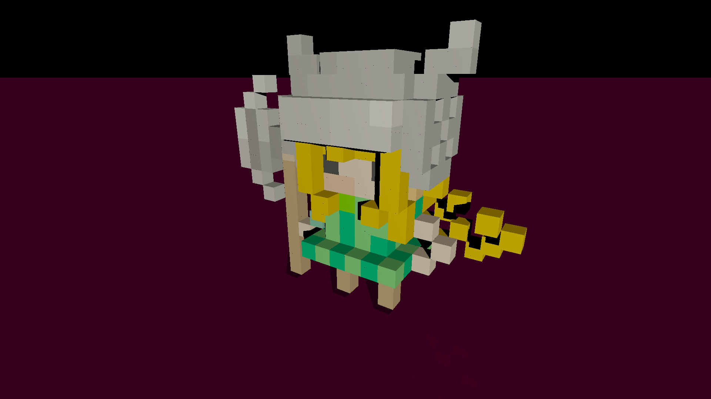
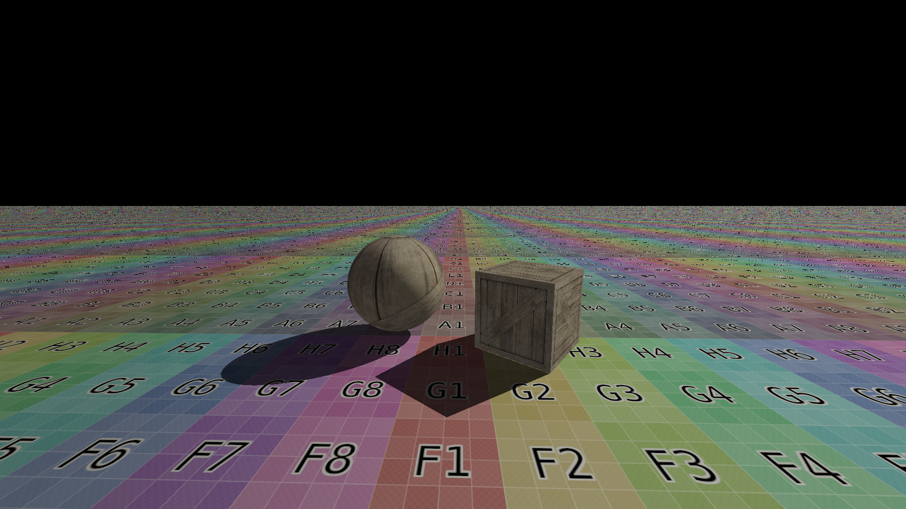
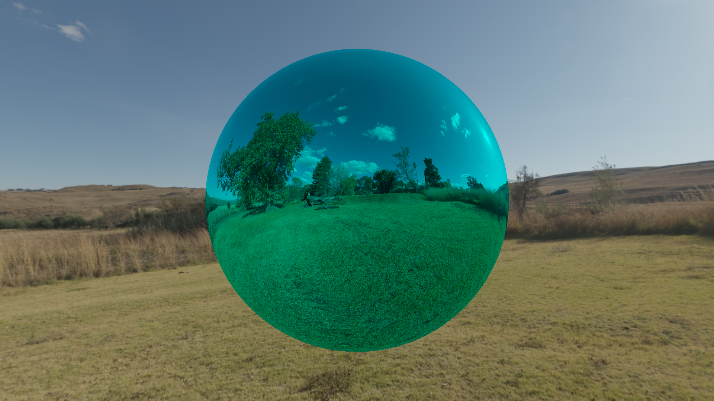

# Examples

## Example 1: Sphere

[file](../resource/scenes/01_sphere.yaml)

## Example 2: Castle

[file](../resource/scenes/02_castle.yaml)

## Example 3: Knight

[file](../resource/scenes/03_knight.yaml)

## Example 4: textures

[file](../resource/scenes/04_textures.yaml)

## Example 5: Environment texture

[file](../resource/scenes/05_environment.yaml)
